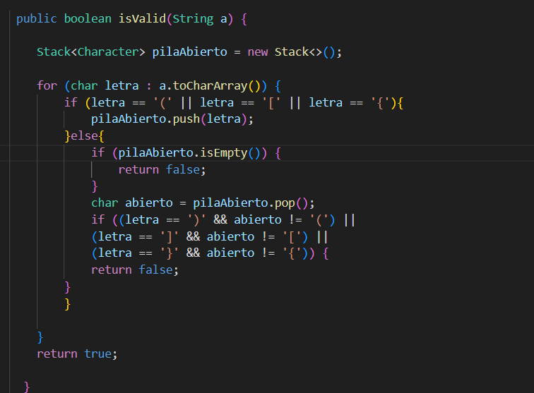
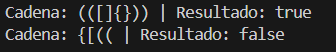
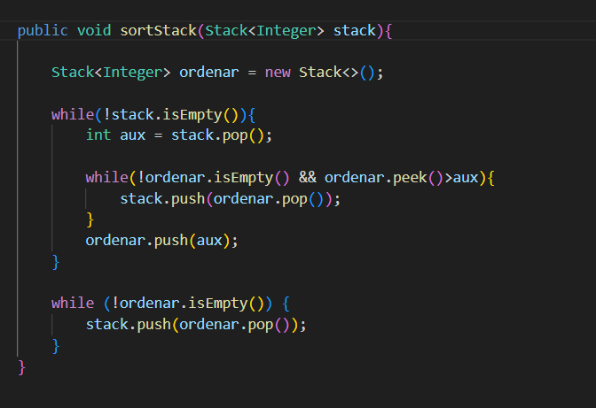
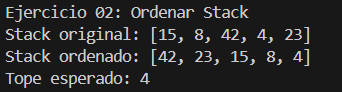
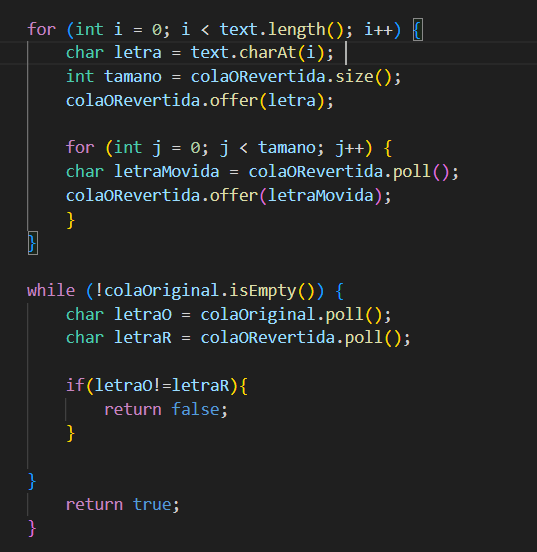
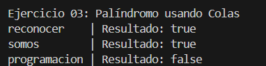
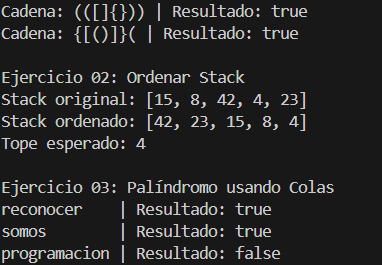

## Datos del Estudiante
- **Nombre:** Alfonso Auquilla-Stephan Cedillo-Oliver Valdiviezo
- **Curso:** Estructura de Datos
- **Fecha:** 13/6/2026

---

## 1. Ejercicio 1

**Descripción:** Para resolver este problema utilicé una pila ("Stack") para guardar los símbolos de apertura que aparecen en la cadena. Luego recorrí cada carácter del texto; si encontraba un paréntesis, corchete o llave de apertura, lo almacenaba en la pila. Cuando encontraba un símbolo de cierre, verificaba que existiera un símbolo de apertura correspondiente y que ambos fueran del mismo tipo. Si no coincidían, la cadena se consideraba inválida. De esta manera, el algoritmo permite determinar si los símbolos están correctamente balanceados y cerrados en el orden adecuado.
**Codigo**

**Salida**

## 2. Ejercicio 2

**Descripción:** (oliver).
**Codigo**

**Salida**

## 3. Ejercicio 3

**Descripción:** En el ejercicio 3 se usaron las colas , luego se pusieron los caracteres para llenar una cola , en la segunda cola se añade la letra al último con .offer(), con una variable guardamos el primer elemento  y eliminandolo con .poll() y andendola al final con .offer(), y así hasta que termine de agregar las letras a la cola copia , así tendremos podremos comparar letra por letra si es igual es un palindromo y si no retorna falso.
**Codigo**

**Salida**

## 4. SALIDA

## 4. Conclusiones
**Conclusion 1:** 
Elegir entre una Pila  o una Cola define por completo cómo se abordará un problema pero ay que tener logica para que si solo podemos
trabajar con uno usar todos los metodos y bucles que nos haga llegar al resultado solo usando colas o solo usando pilas.
**Conclusion 2:** 
Trabajar con estas estructuras obliga a adaptar la lógica a sus restricciones de acceso. Dado que solo se puede interactuar con los extremos.
**Conclusion 3:** 
El manejo correcto de los estados es el factor más crítico para evitar errores lógicos como por ejemplo en la logica del ejercicio 1.

